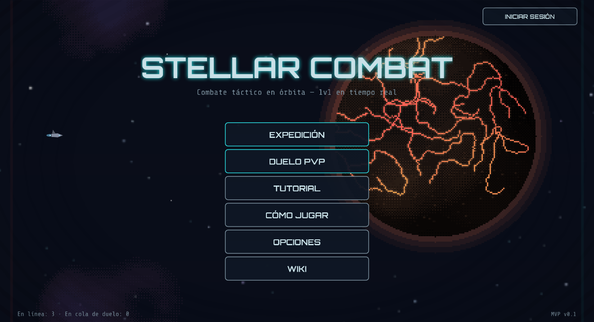
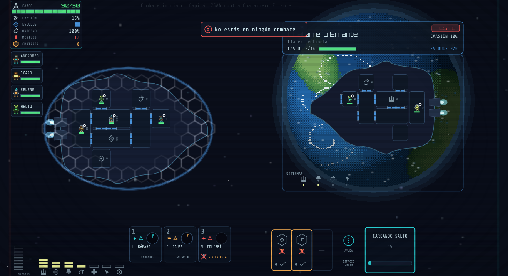
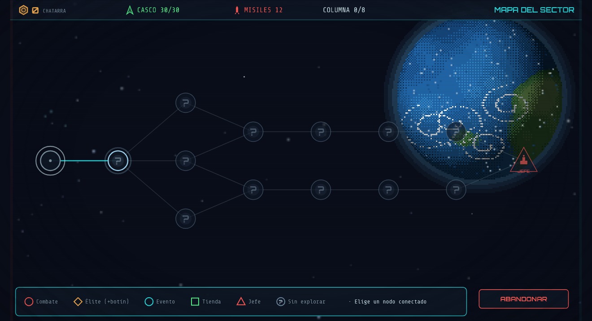
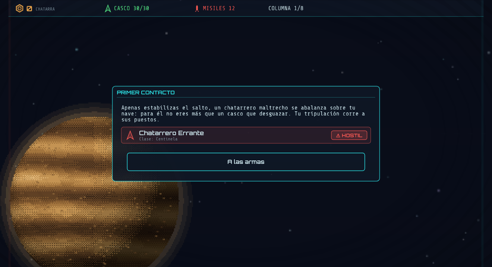
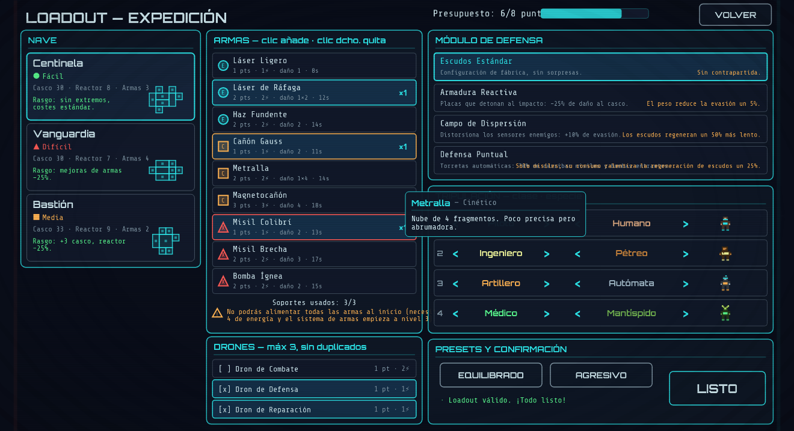
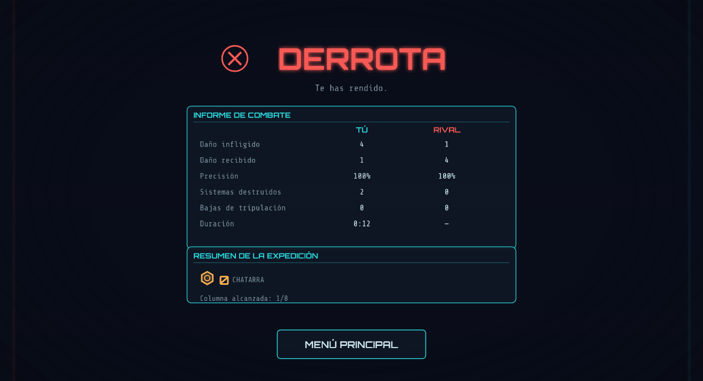

# Stellar Combat

> Real-time tactical 1v1 spaceship combat in the browser — inspired by **FTL: Faster Than Light**.

**Stellar Combat** is a multiplayer, server-authoritative space-combat game where you manage
power, crew, fires and hull breaches across your ship while trading fire with an opponent room
by room. Fight your way through a roguelite expedition or duel another commander in real time.
All artwork is **procedurally generated** (no external sprites) and every sound is **synthesized
at runtime** with the Web Audio API.

This is the MVP of the GDD v0.1.0.

<p align="center">
  
</p>

---

## Table of contents

- [Gameplay](#gameplay)
- [Game modes](#game-modes)
- [Crew & species](#crew--species)
- [Accounts](#accounts-optional)
- [Controls](#controls)
- [Getting started](#getting-started)
- [Tech stack](#tech-stack)
- [Project layout](#project-layout)
- [Documentation](#documentation)

---

## Gameplay

Combat is a tactical duel between two ships rendered as FTL-style cutaways. You distribute a
limited amount of reactor power across systems (weapons, shields, engines, oxygen, medbay…),
aim weapons at individual enemy rooms, and react to fires, hull breaches and boarding as the
fight unfolds. Crew physically walk through doors to man stations, fight fires and repair
damage — so positioning and door management matter as much as firepower.

**The golden rule:** *Energy melts shields · Kinetic punches through hulls · Explosive wrecks systems.*

<p align="center">
  
</p>

---

## Game modes

### Expedition (roguelite run)

A single sector laid out as 8 columns of branching nodes — combats, elites, events and shops —
against progressively tougher NPCs, culminating in a final boss. Earn **scrap**, buy upgrades
and reshape your ship between fights. Before every battle (except the first), an **FTL-style
narrative encounter** offers choices: fight, ambush, evade, or pay a toll. Tactical pause is
available with `SPACE`. If you disconnect mid-combat, the AI takes the helm — and you may lose
the run.

<p align="center">
  
  
</p>

### PvP Duel

Real-time 1v1 against another player (or an AI if no opponent is found), using fixed
**8-point budget loadouts**. No pause; sudden death at the 5-minute mark.

<p align="center">
  
</p>

### Tutorial

A self-contained practice battle against the introductory NPC, with the guided tutorial always
on and tactical pause enabled. Replayable at any time.

---

## Crew & species

Every crew member has a **class** (pilot, engineer, gunner, medic, soldier) and an independent
**species**, each recognizable by silhouette and color:

| Species | Trait |
|---|---|
| **Human** | Balanced baseline |
| **Lithoid** | Tank — resists fire |
| **Automaton** | Doesn't breathe and repairs very fast |
| **Mantispid** | Fast mover |
| **Plasmoid** | Fragile but agile |
| **Glacial** | Extinguishes fires and endures vacuum |

The species of each station is chosen on the loadout screen.

---

## Accounts (optional)

You can play as a guest with no sign-up. From the corner button in the menu you can **register
or log in** to keep a persistent profile with statistics (expeditions, battles, duels, scrap…).
Accounts are stored server-side with **scrypt-hashed passwords** — no external database required.

---

## Controls

| Input | Action |
|---|---|
| `1–4` | Select weapon (then click an enemy room to aim) |
| Right-click (with weapon) | Cancel the selected weapon/target |
| `ESC` | Menu (resume · options · how to play · abandon) |
| `SPACE` | Tactical pause (vs. AI only) |
| `J` | Jump and flee (the FTL drive charges on its own; needs a crew member in engines; forfeits the node's loot) |
| Click a system | Left-click `+1` power · right-click `−1` |
| Click a door | Open/close. Ships start **sealed** (doors closed): open them to spread O₂, close them to isolate a room and suffocate a fire |
| Left-click crew · drag | Select one or several crew members (left-click empty space to deselect) |
| **Right-click** a room | Send the selected crew there |

Crew traverse the ship **through doors** (no diagonal jumps). The enemy AI also manages its own
doors: it seals burning rooms to suffocate fires and mobilizes its crew to fight them.

---

## Getting started

### Quick start

```bash
./start.sh          # builds if needed, starts the server and opens the browser
```

### Manual

```bash
npm install         # first time only
npm run build       # builds the client into client/dist
npm start           # server at http://localhost:3000
```

### Development (live reload)

```bash
npm run dev         # client at http://localhost:5173, server on :3000 behind the proxy
```

### Tests & type-checking

```bash
npm test            # server test suite
npm run typecheck   # type-checks shared/, server/ and client/
```

---

## Tech stack

- **Client** — [Phaser 3](https://phaser.io/) + TypeScript + [Vite](https://vitejs.dev/)
- **Server** — Node.js + Express + [Socket.IO](https://socket.io/), authoritative simulation at **20 ticks/s**
- **Monorepo** — npm workspaces (`shared/`, `server/`, `client/`, `wiki/`)
- **Assets** — 100% procedural artwork (no external sprites); audio synthesized with the Web Audio API

The result screen sums up each fight with a full combat report:

<p align="center">
  
</p>

---

## Project layout

```
stellar-combat/
├── shared/   # Types, protocol and constants shared by client & server
├── server/   # Authoritative simulation, networking and run management
├── client/   # Phaser game, scenes, battle rendering and UI
├── wiki/     # Astro-based game wiki (built into client/public/wiki)
└── docs/     # Design & implementation specs
```

---

## Documentation

- `docs/GAME_SPEC.md` — implementation specification (fills the gaps left by the GDD)
- Original GDD: *"Stellar Combat — Game Design Document"* (PDF)
- In-game **Wiki** — built from `wiki/` and served at `/wiki` (covers modes, ships, systems,
  weapons, modules, drones, crew, environment and events)
